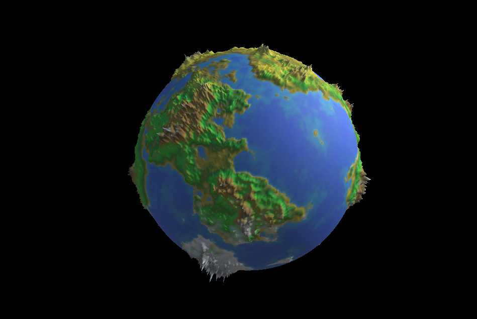

# Procedural Planet Generation
<h2>Following a Tutorial</h2>

The tutorial I am following in this project is from the user "Sebastian Lague" on youtube. 
His profile can be found at: <link>https://www.youtube.com/channel/UCmtyQOKKmrMVaKuRXz02jbQ</link>

Example of a planet generated in this project:

